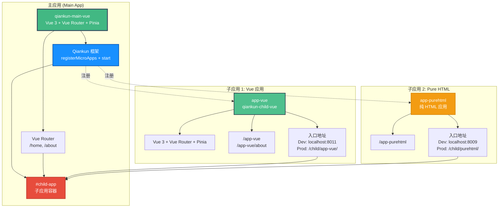

# 微前端架构图

## 架构说明

### 主应用 (qiankun-main-vue)

- **技术栈**: Vue 3 + Vue Router + Pinia + Qiankun
- **职责**:
  - 注册和管理子应用
  - 提供统一的导航和布局
  - 管理子应用的生命周期
- **路由**:
  - `/` - 首页
  - `/about` - 关于页

### 子应用 1: app-vue (qiankun-child-vue)

- **技术栈**: Vue 3 + Vue Router + Pinia
- **路由**:
  - `/app-vue` - 子应用首页
  - `/app-vue/about` - 子应用关于页
- **入口地址**:
  - 开发环境: `http://localhost:8011/`
  - 生产环境: `/child/app-vue/`

### 子应用 2: app-purehtml

- **类型**: 纯 HTML 应用
- **路由**: `/app-purehtml`
- **入口地址**:
  - 开发环境: `http://localhost:8009/`
  - 生产环境: `/child/purehtml/`
- **注意**: 仅在生产环境注册

### 关键特性

- ✅ 样式隔离 (`experimentalStyleIsolation: true`)
- ✅ 沙箱隔离
- ✅ 独立开发和部署
- ✅ 路由集成
- ✅ 生命周期管理
